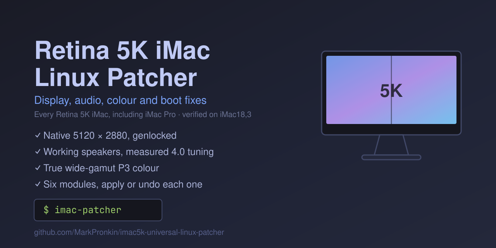

# 🖥️ iMac18,3 Patch



**Makes a 2017 27" 5K iMac work properly under Linux — native 5120×2880, working speakers, and correct colour.**

Apple's 2017 iMac hardware has several things stock Linux gets wrong or doesn't support at all. This repo is a patcher that fixes them, one command at a time, with every change reversible.

```bash
curl -fsSL https://raw.githubusercontent.com/MarkPronkin/imac5k-universal-linux-patcher/main/install.sh | bash
imac-patcher
```

That fetches the latest release (~130 KB), checks it against the published SHA-256, unpacks it under `~/.local/share/imac5k-patcher/`, and links `imac-patcher` into `~/.local/bin`. It installs the tool and stops there — nothing is patched until you run it and choose.

Prefer to read before you run, or want to work on the patches themselves? Clone instead — the patcher runs the same either way:

```bash
git clone https://github.com/MarkPronkin/imac5k-universal-linux-patcher
cd imac5k-universal-linux-patcher
./scripts/imac-patcher
```

> This is an independent continuation of
> [ahmadtv/omarchy-imac18-3-patch](https://github.com/ahmadtv/omarchy-imac18-3-patch),
> not a drop-in replacement for it. It adds the Fedora KDE backend and the
> post-commit DP link recovery described below. See [Credits](#-credits).

The patcher shows you what's applied, what isn't, and lets you pick. Nothing is applied without asking.

### 🐧 Distributions

The patcher detects which of these it's running on and uses the matching backend — same menu, same module names, same `--apply`/`--remove` commands.

| | Packages | Kernel source | Boot / initramfs | Display control | Hardware-tested |
|---|---|---|---|---|---|
| **Omarchy / Arch** | pacman | kernel.org tarball | Limine + mkinitcpio | Hyprland | ✅ this is where the patches were developed and verified |
| **Fedora KDE** | DNF | matching Fedora source RPM | GRUB/BLS + dracut | KScreen (Plasma Wayland) | ⚠️ build, install and restore verified; display/audio behaviour not yet confirmed on hardware |

Fedora specifics — dependencies, Secure Boot signing, recovery, and how the backend is wired in — are in the **[Fedora KDE guide](docs/fedora-kde.md)**. Fedora Kinoite/Atomic is not supported.

---

## 🔧 What it fixes

| | Problem on stock Linux | Status |
|---|---|---|
| 🖥️ **Display** | Panel is two 2560×2880 tiles; stock `amdgpu` drives one and stretches it. No native 5K. | ✅ Native 5120×2880, genlocked |
| 🔊 **Speakers / mic** | CS8409 codec: kernel finds no speaker output at all. Silent machine. | ✅ Hardware-gated DKMS driver |
| 🎚️ **Speaker tone** | Codec does zero DSP and the woofers and tweeters are driven as one stereo pair; macOS does all of it in software. | ✅ Measured 4.0 crossover, EQ and convolution |
| 🎨 **Colour** | Wide-gamut (P3) panel rendered as sRGB — everything oversaturated. | ✅ Correct gamut mapping |
| 😴 **Suspend** | Hard-hangs the machine every time (Apple firmware ACPI issue). | ⚠️ Masked off — see below |
| ⚡ **Thunderbolt / 10GbE** | Adapter detected but never authorised. | ✅ Persistent enrolment |

---

## 🖥️ The headline: native 5K

The internal panel is a genuine dual-tile display — two 2560×2880 halves on separate physical links, which Apple's firmware leaves half-asleep for non-Apple operating systems. Stock `amdgpu` only ever lights one tile and lets the panel stretch it.

The patch stack fixes this in three layers, all inside the `amdgpu` module:

1. ⚡ **Wake** — a vendor DPCD write (`0x4F1`) powers up the dormant second link
2. 🧵 **Stitch** — both tiles are presented to userspace as one 5120×2880 output, so compositors work unmodified
3. 🔒 **Genlock** — per-frame CRTC sync so the two halves scan in lockstep (mainline has this as a literal `TODO`; filling it is this project's own contribution, submitted upstream)

Install it without a second kernel — only the `amdgpu` module is rebuilt for your running kernel, with the stock module backed up:

```bash
./scripts/imac-patcher            # menu-driven
./scripts/imac-patcher --apply 5k  # or direct
./scripts/imac-patcher --remove 5k # full undo, any time
```

**Read [`patches/README.md`](patches/README.md) first.** The patch is verified against kernel **7.1.x and 7.2.x only** and the installer refuses anything else, because a mis-applied patch means a broken GPU module.

You don't need to supply any files — the patch ships in this repo, and the installer downloads the matching kernel source from kernel.org itself. What you do need:

The dependency and boot notes below describe **Omarchy/Arch**. Fedora builds against its matching source RPM and `kernel-devel` instead, and needs more disk — follow the [Fedora guide](docs/fedora-kde.md).

- 🛠️ **Build tools and kernel headers** — `base-devel bc pahole linux-headers`. The patcher checks for these up front and offers to install anything missing, rather than failing part-way through a compile.
- 💾 **About 8 GB of disk** for the kernel source tree.
- ⏱️ **20–40 minutes** for the first build. Re-runs (e.g. after a kernel update) reuse the tree and are much faster.

Re-run it after any kernel update — the patched module is built for one specific kernel version and a new kernel reverts you to stock (which the patcher will report as `partial`).

---

## 🔊 Audio

The CS8409 codec needs an out-of-tree driver — the in-kernel one doesn't recognise a speaker output on this board at all:

```bash
git clone https://github.com/jackdanyell/imac18-3-cs8409-linux-audio
cd imac18-3-cs8409-linux-audio && sudo ./install-imac18-3.sh && sudo reboot
```

Then, optionally, the speaker tuning:

```bash
./scripts/imac-patcher --apply eq
```

The four speakers are two woofers and two tweeters, which the driver presents as a 4-channel card and everything else drives as a plain stereo pair. This switches the card to its **Analog Surround 4.0** profile and inserts a PipeWire filter-chain that crosses over at 3.8 kHz, EQs the two ways separately and convolves each with a measured impulse response — [taprobane99](https://github.com/taprobane99/iMac5KLinux)'s tuning, measured with a calibrated microphone. Only that project's `Audio/` files are used; its kernel, display and GRUB work is not touched.

It needs two LV2 plugin sets — `lsp-plugins-lv2` and `bankstown` (AUR) — and offers to install them. The files are downloaded at apply time rather than shipped here, so the tuning is always the upstream one. Everything lands in your home directory: `~/.config/pipewire/pipewire.conf.d/imac-audio.conf` and `~/.local/share/imac-audio/`, with nothing written as root.

While the tuning is installed, the raw 4.0 device is hidden from sound pickers (a WirePlumber rule marks it internal, so the chain still feeds it but nothing offers it): selected directly it plays the tweeter half of the crossover and sounds thin. `--remove eq` puts the card profile, the default sink and that device back.

**On loudness.** This is a corrective tuning, not a loudness profile — expect it to be somewhat quieter than stock at the same slider position. The woofer path runs about 8 dB down with a compressor and limiter, two bands are notched, the impulse responses flatten the speakers' peaks, and the crossover stops all four drivers reproducing everything at once. Flat costs level on these speakers.

The tuning was measured on an iMac17,1 (2015), which has the same 4.0 speaker layout; if it sounds inverted — treble from the woofers — the channel mapping on your board differs and `--remove eq` restores it.

If it ever sounds thin and far too quiet, the card has fallen back to its stereo profile: the chain still produces four channels, but the two woofer ones link to nothing and you are hearing the tweeter half of a crossover. `--status` reports that as `partial` rather than `applied`; `pactl list cards | grep 'Active Profile'` confirms it, and re-applying selects the 4.0 profile again.

---

## 🎨 Colour

On KDE Plasma Wayland, `./scripts/imac-patcher --apply color` selects the panel's EDID colour profile through KScreen, and `--remove color` puts your previous selection back. The setting below is the Hyprland equivalent.

The panel is wide-gamut Display P3. Hyprland's default `srgb` mode doesn't gamut-map for it, so everything looks oversaturated. In `~/.config/hypr/monitors.lua`:

```lua
hl.monitor({ output = "", mode = "preferred", position = "auto", scale = 2, cm = "dp3" })
```

---

## 😴 Suspend — read this before you try it

Suspend and hibernate **hard-hang this machine, every time**. This is an Apple firmware ACPI issue, not something a kernel parameter fixes; sleep mode, the display override, and GPU power states were each ruled out by testing. Recovery is a hard power-cycle.

The patcher masks the sleep targets so nothing triggers them by accident:

```bash
sudo systemctl mask suspend.target hibernate.target hybrid-sleep.target suspend-then-hibernate.target
```

---

## 🚧 Known rough edges

- 🌗 **Skewed Apple logo on *warm* reboots** with 5K active — root-caused: the display was never turned off at reboot, so Apple's firmware inherited a live dual-tile panel. **Fixed and shipped** (`patches/5k-latch-clear.patch`): the display is shut down properly at reboot, every register the stitch wrote into the second tile is undone, and the panel is powered off before the handoff. Confirmed on hardware with a captured teardown. A follow-up (`patches/5k-latch-clear-going-down-only.patch`) limits that teardown to the reboot path — as first shipped it also ran on every ordinary stream-off and caused repeated black flashes on the second tile (see below). What remains: the warm-reboot logo is straight but slightly soft, because the firmware draws it on one tile after the handoff; a cold boot is crisp. Cosmetic.
- 🪞 **Sheared seam after login** — two causes, both **fixed and shipped**: the driver's master pick left the slave tile out of the hardware sync group (`patches/5k-genlock-deterministic.patch`), and on a full modeset the one-shot alignment ran before the re-trained tile was up (`patches/5k-genlock-settle-resync.patch`, a re-sync 250 ms after each tiled commit). The black flashes on the second tile after the disk password, and the brief skew as the session exits before a reboot, were a regression from the first logo fix (its latch clear ran on every stream-off and each write toggled the tile's hotplug line, forcing a full re-detect and re-train on the next commit — 30–40 re-detects per boot instead of 4). Fixed and shipped: `patches/5k-latch-clear-going-down-only.patch`.
- 🎬 **Video encode (VCE)** hangs the GPU on certain transcodes, taking the session down. Under investigation.
- 📺 **YouTube 4K is CPU-decoded** — Polaris has no VP9/AV1 silicon. Hardware limit, not fixable.

---

## 📋 Requirements

- Apple iMac18,3 (2017 27" 5K). The patcher refuses to run on other hardware.
- Kernel 7.1.x or 7.2.x for the 5K patch (everything else is version-independent)
- Omarchy (Limine + Hyprland) or Fedora KDE (GRUB/dracut + Plasma Wayland) — see [Distributions](#-distributions) above. The audio, tuning and colour pieces are largely distribution-agnostic; the boot-related pieces are not, and each backend refuses to touch the other's bootloader.
- Nothing to install by hand: on startup the patcher checks the handful of basics it needs (`grep`, `sed`, `awk`, `findutils`, `coreutils`, `sudo`) and offers to install any that are missing. Each patch checks its own heavier dependencies when you run it. The full list is in [DEPENDENCIES.md](DEPENDENCIES.md).

## 📦 Updating and removing the tool

The tool updates itself:

```bash
imac-patcher upgrade
```

It checks for a newer release, installs it if there is one, and says so if there isn't. The previous two versions stay under `~/.local/share/imac5k-patcher/versions/`, so a rollback is one symlink. Re-running the install command does the same thing. (A git checkout is upgraded with `git pull` — `upgrade` will tell you so rather than overwrite it.)

Upgrading replaces the tool, not the patches: whatever you had applied stays applied. If a release changes a patch you're running, re-apply it to pick the new one up — `imac-patcher --status` shows where you stand.

Pin a specific release, or take the tool back off the machine:

```bash
curl -fsSL https://raw.githubusercontent.com/MarkPronkin/imac5k-universal-linux-patcher/main/install.sh | bash -s -- --version v0.1.0-alpha
curl -fsSL https://raw.githubusercontent.com/MarkPronkin/imac5k-universal-linux-patcher/main/install.sh | bash -s -- --uninstall
```

Uninstalling removes the tool, **not the patches** — those outlive it, so reverse anything you want gone with `imac-patcher --remove <id>` first. `imac-patcher --status` lists what is applied.

## 🛟 Safety

On Fedora, follow the [Fedora restore and recovery instructions](docs/fedora-kde.md#restore-and-recovery) — the Limine specifics below are Omarchy's.

Every patch backs up what it replaces and can be reversed. Boot-related changes print their recovery steps *before* running. A new `amdgpu` build never has to replace the working one to be tried: `scripts/imac-alt-entry add <name> <module>` boots it from its own hash-pinned Limine entry with the default untouched (see [`patches/README.md`](patches/README.md)). If a boot change ever goes wrong: boot the Limine snapshot entry, restore `/etc/default/limine.backup`, re-run `limine-mkinitcpio`, reboot.

## 🧭 How this was worked out

Open items, root causes and rejected approaches are tracked in [`TODO.md`](TODO.md).

## 🙏 Credits

This project began as a fork of **[ahmadtv/omarchy-imac18-3-patch](https://github.com/ahmadtv/omarchy-imac18-3-patch)** by Ahmad Al-Awadi, which is where the patcher, the 5K stitch work and the original Omarchy backend come from. It is MIT licensed, and that copyright is retained in [`LICENSE`](LICENSE) alongside the one for the changes made here. The full commit history of the original is preserved in this repository, so `git log` attributes every one of those commits to its author.

Carried on separately rather than as a pull request because the changes here — a second distribution backend, and a driver change whose cause is still open — are larger and less settled than a fork should carry back upstream. Nothing here is endorsed by the original author.

Native 5K builds on community work from [drm/amd#4455](https://gitlab.freedesktop.org/drm/amd/-/issues/4455) — mforce2 (tile wake), erik2 (stitch), taprobane99 (7.2.2 port), with guidance from AMD's Alex Deucher. The genlock fix and the first verified iMac18,3 result came from this project. Audio driver by [jackdanyell](https://github.com/jackdanyell/imac18-3-cs8409-linux-audio). The speaker tuning the `eq` module installs is [taprobane99](https://github.com/taprobane99/iMac5KLinux)'s, measured on an iMac17,1 and fetched from that repository at apply time rather than vendored here.
